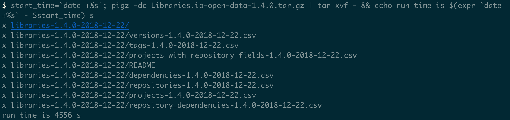
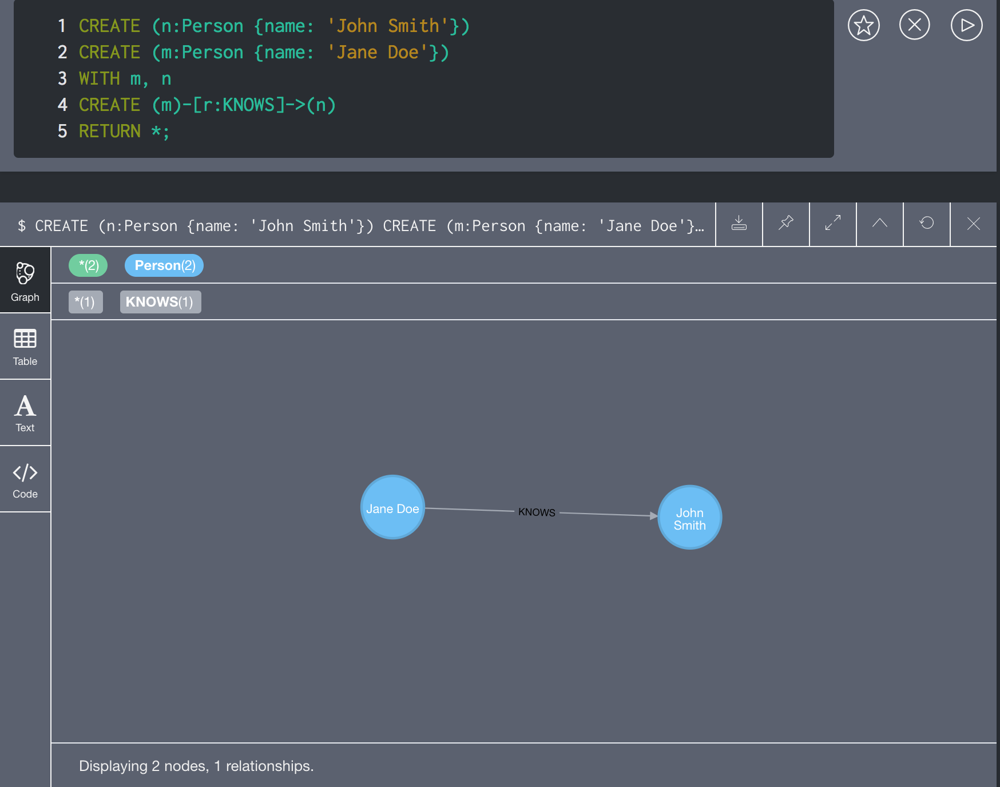
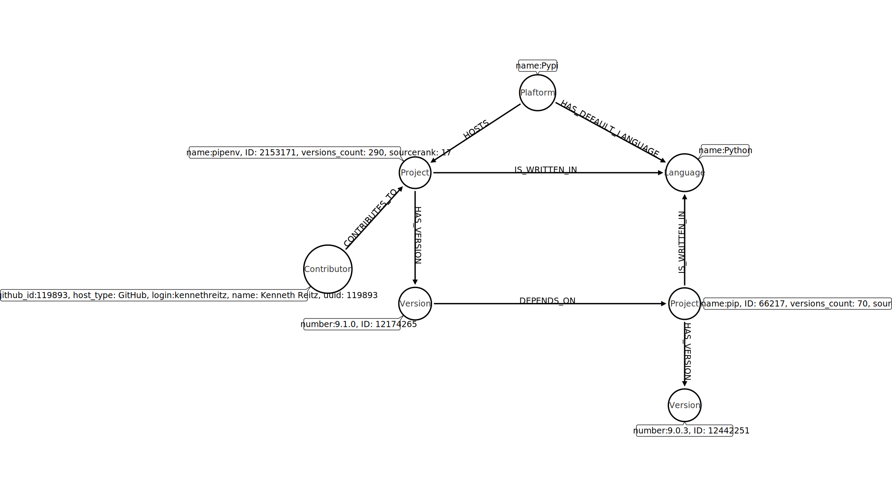
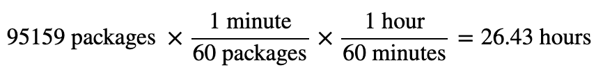
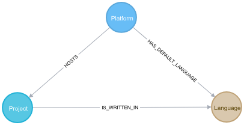
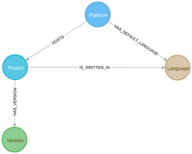
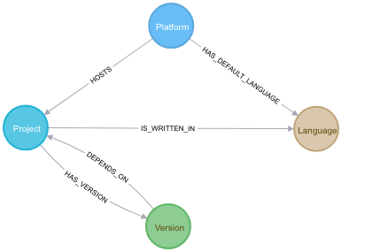
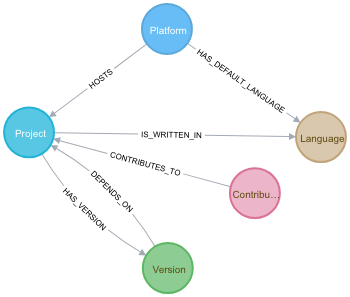
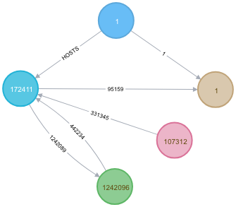

# Finding the Most Influential PyPi Contributor using Neo4j and Libraries.io Open Data
Upon coming across the excellent [`pipenv`](https://pipenv.readthedocs.io/en/latest/) 
package, written by Kenneth Reitz (he of [`requests`](https://requests.readthedocs.io/en/latest/)
fame), I wondered whether the adoption of this package by the Python Packaging 
Authority as the go-to 
[dependency manager for Python](https://packaging.python.org/guides/tool-recommendations/#application-dependency-management)
makes Kenneth Reitz the most influential Python contributor on PyPi. After all, 
his mantra when developing a package is "<_Insert programming activity here_> for __humans__".

We will analyze the Python projects uploaded to the
[Python Package Index](https://pypi.org); specifically:
  * The Python packages
  * What packages depend on what other packages
  * Who contributes to what packages
using the degree centrality algorithm from graph theory to find the most influential
node in the graph of Python packages, dependencies, and contributors.
## Summary of Results
After constructing the graph and
[analyzing the degree centrality](https://neo4j.com/docs/graph-algorithms/current/algorithms/degree-centrality/),
despite his `requests` package being far and away the most influential Python package
in the graph, Kenneth Reitz is only the 9th-most-influential `Contributor`.
The `Contributor` with the highest degree centrality is
[Jon Dufresne](https://github.com/jdufresne), and it's not even close; below are the
top 10:

|Contributor|GitHub login|Degree Centrality Score|
|---|---|---|
|Jon Dufresne|jdufresne|908745|
|Marc Abramowitz|msabramo|504221|
|Donald Stufft|dstufft|383271|
|Hugo|hugovk|363857|
|Jason R. Coombs|jaraco|340564|
|Anthony Sottile|asottile|339792|
|Felix Yan|felixonmars|332378|
|Ian Stapleton Cordasco|sigmavirus24|326373|
|Kenneth Reitz|kennethreitz|288946|
|Cory Benfield|Lukasa|272798|

What no doubt contributed to @jdufresne's stratospheric score is
that he contributes to 6 of the 10 most-influential projects from
a degree centrality perspective, and 5 of the 10 most-depended-on
projects (i.e. the number of incoming `DEPENDS_ON` relationships.
The hypothesized most-influential `Contributor`, Kenneth Reitz,
contributes to only 2 and 1 of these projects, respectively.

For more context around this finding and how it was reached, read on.
## The Approach
### Libraries.io Open Data
[PyPi](https://pypi.org/) is the repository for Python packages that developers
know and love. Analogously to PyPi, other programming languages have their respective package
managers, such as CRAN for `R`. As a natural exercise in abstraction, 
[Libraries.io](https://libraries.io) is a meta-repository for 
package managers. From [their website](https://libraries.io/data):

> Libraries.io gathers data from **36** package managers and **3** source code repositories. 
We track over **2.7m** unique open source packages, **33m** repositories and **235m**
interdependencies between [sic] them. This gives Libraries.io a unique understanding of 
open source software. An understanding that we want to share with **you**.

#### Using Open Data Snapshot to Save API Calls
Libraries.io has an easy-to-use [API](https://libraries.io/api), but
given that PyPi is the fourth-most-represented package manager in the Open Data
with 200,000+ packages, the number of API calls to various endpoints to collate 
the necessary data is not appealing (also, Libraries.io rate limits to 60 requests
per minute). Fortunately, [Jeremy Katz on Zenodo](https://zenodo.org/record/2536573)
maintains snapshots of the Libraries.io Open Data source. The most recent
version is a snapshot from 22 December 2018, and contains the following CSV files:
  1. Projects (3 333 927 rows)
  2. Versions (16 147 579 rows)
  3. Tags (52 506 651 rows)
  4. Dependencies (105 811 885 rows)
  5. Repositories (34 061 561 rows)
  6. Repository dependencies (279 861 607 rows)
  7. Projects with Related Repository Fields (3 343 749 rows)

More information about these CSVs is in the `README` file included in the Open
Data tar.gz, copied [here](https://github.com/ebb-earl-co/libraries_io/blob/master/data/README).
There is a substantial reduction in the data when subsetting these CSVs just
to the data pertaining to PyPi; find the code used to subset them and the
size comparisons [here](https://github.com/ebb-earl-co/libraries_io/blob/master/data/pypi_subsetting.md).

**WARNING**: The tar.gz file that contains these data is 13 GB itself, and
once downloaded takes quite a while to un`tar`; once uncompressed, the data
take up 64 GB on disk!



### Graph Databases, Starring Neo4j
Because of the interconnected nature of software packages (dependencies,
versions, contributors, etc.), finding the most influential "item" in that web 
of data make [graph databases](https://db-engines.com/en/ranking/graph+dbms) and 
[graph theory](https://medium.freecodecamp.org/i-dont-understand-graph-theory-1c96572a1401)
the ideal tools for this type of analysis. [Neo4j](https://neo4j.com/product/)
is the most popular graph database according to [DB engines](https://neo4j.com/product/),
and is the one that we will use for the analysis. Part of the reason for its popularity
is that its query language, [Cypher](https://neo4j.com/developer/cypher-query-language/),
is expressive and simple:



Terminology that will be useful going forward:
  - `Jane Doe` and `John Smith` are __nodes__ (equivalently: __vertexes__)
  - The above two nodes have __label__ `Person`, with __property__ `name`
  - The line that connects the nodes is an __relationship__ (equivalently: __edge__)
  - The above relationship is of __type__ `KNOWS`
  - `KNOWS`, and all Neo4j relationships, are __directed__; i.e. `Jane Doe`
  knows `John Smith`, but not the converse

On MacOS, the easiest way to use Neo4j is via the Neo4j Desktop app, available 
as the [`neo4j` cask on Homebrew](https://github.com/Homebrew/homebrew-cask/blob/master/Casks/neo4j.rb).
Neo4j Desktop is a great IDE for Neo4j, allowing simple installation of different
versions of Neo4j as well as plugins that are optional 
(e.g. [`APOC`](https://neo4j.com/docs/labs/apoc/current/)) but
are really the best way to interact with the graph database. Moreover, the
screenshot above is taken from the Neo4j Browser, a nice interactive
database interface as well as query result visualization tool.
#### Neo4j Configuration
Before we dive into the data model and how the data are loaded, Neo4j's
default configuration isn't going to cut it for the packages and approach
that we are going to use, so the customized configuration file can be found
[here](https://github.com/ebb-earl-co/libraries_io/blob/master/data/neo4j.conf),
corresponding to Neo4j version 3.5.7.
### Making a Graph of Libraries.io Open Data
[Importing from CSV](https://neo4j.com/docs/cypher-manual/3.5/clauses/load-csv/)
is the most common way to populate a Neo4j graph, and is how we will
proceed given that the Open Data snapshot un`tar`s into CSV files. However,
first a data model is necessary— what the entities that will be
represented as labeled nodes with properties and the relationships 
among them are going to be. Moreover, some settings of Neo4j
will have to be customized for proper and timely import from CSV.
#### Data Model
Basically, when translating a data paradigm into graph data form, the nouns
become nodes and how the nouns interact (the verbs) become the relationships.
In the case of the Libraries.io data, the following is the data model
(produced with the [Arrow Tool](https://www.apcjones.com/arrow)):



So, a `Platform` `HOSTS` a `Project`, which `IS_WRITTEN_IN` a `Language`,
and `HAS_VERSION` `Version`. Moreover, a `Project` `DEPENDS_ON` other 
`Project`s, and `Contributor`s `CONTRIBUTE_TO` `Project`s. With respect to 
`Version`s, the diagram communicates a limitation of the Libraries.io
Open Data: that `Project` nodes are linked in the dependencies CSV to other
`Project` nodes, despite the fact that different versions of a project
depend on varying versions of other projects. Take, for example, this row
from the [dependencies CSV](https://github.com/ebb-earl-co/libraries_io/blob/master/data/pypi_subsetting.md#dependencies):

|ID|Project\_Name|Project\_ID|Version\_Number|Version\_ID|Dependency\_Name|Dependency\_Kind|Optional\_Dependency|Dependency\_Requirements|Dependency\_Project\_ID|
|---|---|---|---|---|---|---|---|---|---|
|34998553|1pass|31613|0.1.2|22218|pycrypto|runtime|false|\*|68140|

I.e.; `Version` 0.1.2 of `Project` `1pass` depends on `Project` `pycrypto`.
There is no demarcation of __which__ version of `pycrypto` it is that
version 0.1.2 of `1pass` depends on, other than `*` which forces the
modeling decision of `Project`s depending on other `Project`s, not `Version`s.
#### Contributors, the Missing Data
It is impossible to answer the question of what contributor to Pypi is
most influential without, obviously, data on contributors. However, the
Open Data dataset lacks this information. In order to connect the Open
Data dataset with contributors data will require calls to the
[Libraries.io API](https://libraries.io/api). As mentioned above, there
is a rate limit of 60 requests per minute. If there are

```bash
$ mlr --csv filter '$Platform == "Pypi" && $Language == "Python"' projects-1.4.0-2018-12-22.csv | wc -l
   95160
```
Python-language Pypi packages, each of which sends one request to the
[Contributors endpoint](https://libraries.io/api#project-contributors)
of the Libraries.io API, at "maximum velocity", it will require



to get contributor data for each project.

Following the example of
[this blog](https://tbgraph.wordpress.com/2018/06/28/finding-alternative-routes-in-california-road-network-with-neo4j/),
it is possible to use the aforementioned APOC utilities for Neo4j to
[load data from web APIs](https://neo4j.com/docs/labs/apoc/current/import/web-apis/),
but I found it to be unwieldy and difficult to monitor. So, I used
Python's `requests` and `SQLite` packages to send requests to the
endpoint and store the responses in a long-running Bash process 
(code for this [here](https://github.com/ebb-earl-co/libraries_io/blob/master/python/request_libraries_io_load_sqlite.py)).
#### Database Constraints
Analogously to the unique constraint in a relational database, Neo4j has a
[uniqueness constraint](https://neo4j.com/docs/cypher-manual/3.5/schema/constraints/#query-constraint-unique-nodes)
which is very useful in constraining the number of nodes created. Basically,
it isn't useful, and hurts performance, to have two different nodes representing the
platform Pypi (or the language Python, or the project `pipenv`, ...) because
it is a unique entity. Moreover, uniqueness constraints enable 
[more performant queries](https://neo4j.com/docs/cypher-manual/3.5/clauses/merge/#query-merge-using-unique-constraints).
The following
[Cypher commands](https://github.com/ebb-earl-co/libraries_io/blob/master/cypher/schema.cypher)
add uniqueness constraints on the properties of the nodes that should be unique
in this data paradigm:
```cypher
CREATE CONSTRAINT on (platform:Platform) ASSERT platform.name IS UNIQUE;
CREATE CONSTRAINT ON (project:Project) ASSERT project.name IS UNIQUE;
CREATE CONSTRAINT ON (project:Project) ASSERT project.ID IS UNIQUE;
CREATE CONSTRAINT ON (version:Version) ASSERT version.ID IS UNIQUE;
CREATE CONSTRAINT ON (language:Language) ASSERT language.name IS UNIQUE;
CREATE CONSTRAINT ON (contributor:Contributor) ASSERT contributor.uuid IS UNIQUE;
```
All of the `ID` properties come from the first column of the CSVs and are 
ostensibly primary key values. The `name` property of `Project` nodes is
also constrained to be unique so that queries seeking to match nodes on
the property name— the way that we think of them— are performant as well.
## Populating the Graph
With the constraints, plugins, and configuration of Neo4j in place,
the Libaries.io Open Data dataset can be loaded.  Loading CSVs to Neo4j
can be done with the default
[`LOAD CSV` command](https://neo4j.com/docs/cypher-manual/current/clauses/load-csv/),
but in the APOC plugin there is an improved version,
[`apoc.load.csv`](https://neo4j.com/docs/labs/apoc/current/import/load-csv/#load-csv),
which iterates over the CSV rows as map objects instead of arrays; 
when coupled with
[periodic execution](https://neo4j.com/docs/labs/apoc/current/import/load-csv/#_transaction_batching)
(a.k.a. batching), loading CSVs can be done in parallel, as well.
### Creating Python and Pypi Nodes
As all projects that are to be loaded are hosted on Pypi, the first
node to be created in the graph is the Pypi `Platform` node itself:
```cypher
CREATE (p:Platform {name: 'Pypi'});
```
Not all projects hosted on Pypi are written in Python, but those are
the focus of this analysis, so we need a Python `Language` node:
```cypher
CREATE (l:Language {name: 'Python'});
```
With these two, we create the first relationship of the graph:
```cypher
MATCH (p:Platform {name: 'Pypi'})
MATCH (l:Language {name: 'Python'})
CREATE (p)-[:HAS_DEFAULT_LANGUAGE]->(l);
```
Now we can load the rest of the entities in our graph, connecting them
to these as appropriate, starting with `Project`s.
### Neo4j's `MERGE` Operation
The key operation when loading data to Neo4j is the
[MERGE clause](https://neo4j.com/docs/cypher-manual/current/clauses/merge/#query-merge-using-unique-constraints).
Using the property specified in the query, MERGE either MATCHes the node/relationship
with the property, and, if it doesn't exist, duly CREATEs the node/relationship.
If the property in the query has a uniqueness constraint, Neo4j can thus iterate
over possible duplicates of the "same" node/relationship, only creating it once,
and "attaching" nodes to the uniquely-specified node on the go. 

This is a double-edged sword, though, in the situation of creating relationships 
between unique nodes; if the participating nodes are not specified exactly, to 
MERGE a relationship between them will create __new__ node(s) that are duplicates.
This is undesirable from an ontological perspective, as well as a database
efficiency perspective. So, all this to say that, to create unique
node-relationship-node entities requires _three_ passes over a CSV: the first
to MERGE the first node type, the second to MERGE the second node type, and
the third to MATCH node type 1, MATCH node type 2, and MERGE the relationship
between them.

Lastly, for the same reason as the above, it is necessary to create "base" nodes
before creating nodes that "stem" from them. For example, if we had not created
the Python `Language` node above (with unique property `name`), for every Python
project MERGED from the projects CSV, Neo4j would create a new `Language` node
with name 'Python' and a relationship between it and the Python `Project` node.
This duplication can be useful in some data models, but in the interest of
parsimony, we will load data in the following order:
  1. `Project`s
  2. `Version`s
  3. Dependencies among `Project`s and `Version`s
  4. `Contributor`s
#### Loading `Project`s
First up is the `Project` nodes. The source CSV for this type of node is
[pypi\_projects.csv](https://github.com/ebb-earl-co/libraries_io/blob/master/data/pypi_subsetting.md#projects)
and the queries are in 
[this file](https://github.com/ebb-earl-co/libraries_io/blob/master/cypher/projects_apoc.cypher).
Neo4j loads the CSVs data following the instructions of the file with the
[`apoc.cypher.runFile`](https://neo4j.com/docs/labs/apoc/current/cypher-execution/) command; i.e.
```
CALL apoc.cypher.runFile('/path/to/libraries_io/cypher/projects_apoc.cypher') yield row, result return 0;
```
The result of this set of queries is that the following portion of our graph
is populated:


#### Loading `Version`s
Next are the `Version`s of the `Project`s. The source CSV for this type
of node is [pypi\_versions.csv](https://github.com/ebb-earl-co/libraries_io/blob/master/data/pypi_subsetting.md#versions)
and the queries are in
[this file](https://github.com/ebb-earl-co/libraries_io/blob/master/cypher/versions_apoc.cypher).
These queries are run with
```
CALL apoc.cypher.runFile('/path/to/libraries_io/cypher/versions_apoc.cypher') yield row, result return 0;
```
The result of this set of queries is that the graph has grown to include
the following nodes and relationships:


#### Loading Dependencies among `Project`s and `Version`s
Now that there are `Project` nodes and `Version` nodes, it's time to
link their dependencies. The source CSV for these data is 
[pypi\_dependencies.csv](https://github.com/ebb-earl-co/libraries_io/blob/master/data/pypi_subsetting.md#dependencies)
and this query is in
[this file](https://github.com/ebb-earl-co/libraries_io/blob/master/cypher/dependencies_apoc.cypher).
Because the `Project`s and `Version`s already exist, this operation
is just the one MATCH-MATCH-MERGE query, creating relationships. It is run with
```
CALL apoc.cypher.runFile('/path/to/libraries_io/cypher/dependencies_apoc.cypher') yield row, result return 0;
```
The result of this set of queries is that the graph has grown to include
the `DEPENDS_ON` relationship:


#### Loading `Contributor`s
Because the data corresponding to Python `Project` `Contributor`s was
retrieved from the API, it is not run with Cypher from a file, but
in a Python script, particularly 
[this section](https://github.com/ebb-earl-co/libraries_io/blob/master/python/merge_contributors.py#L95-L127).
After executing this process, the graph is now in its final form:


## Preliminary Results
The below is the same image of the full schema, but with node and
relationship counts instead of labels (the labels of nodes and
relationships are color-coded still):



On the way to understanding the most influential `Contributor`,
it is useful to find the most influential `Project`. Intuitively,
the most influential `Project` node should be the node with the
most (or very many) incoming `DEPENDS_ON` relationships; however,
the degree centrality algorithm is not as simple as just counting
the number of relationships incoming and outgoing and ordering by
descending cardinality (although that is a useful metric for
understanding a [sub]graph). This is because the subgraph that
we are considering to understand the influence of `Project` nodes
also contains relationships to `Version` nodes.

### Degree Centrality
So, using the Neo4j Graph Algorithm plugin's
[`algo.degree`](https://neo4j.com/docs/graph-algorithms/current/algorithms/degree-centrality/#algorithms-degree-centrality)
procedure, all we need are a node label and a relationship type.
The arguments to this procedure could be as simple as two strings,
one for the node label, and one for the relationship type. However,
as mentioned above, there are two node labels at play here, so we
will use the [alternative syntax](https://neo4j.com/docs/graph-algorithms/current/algorithms/degree-centrality/#algorithms-degree-cp)
of the `algo.degree` procedure in which we pass Cypher statements
returning the set of nodes and the relationships among them.

To run the degree centrality algorithm on the `Project`s written
in `Python` that are hosted on `Pypi`, the syntax
([found here](https://github.com/ebb-earl-co/libraries_io/blob/master/cypher/project_degree_centrality.cypher))
is:

```cypher
call algo.degree.stream(
    "MATCH (:Language {name:'Python'})<-[:IS_WRITTEN_IN]-(p:Project)<-[:HOSTS]-(:Platform {name:'Pypi'}) return id(p) as id",
    "MATCH (p1:Project)-[:HAS_VERSION]->(:Version)-[:DEPENDS_ON]->(p2:Project) return id(p2) as source, id(p1) as target",
    {graph: 'cypher', write: False}
)
YIELD nodeId, score
RETURN algo.asNode(nodeId).name as project, score as degree_centrality_score
ORDER BY degree_centrality_score DESC
;
```
It is **crucially** important to alias as `source` the `Project` 
node MATCHed in the second query as the _end node_ of the 
`DEPENDS_ON` relationship, and the _start node_ of the
relationship as `target`. This is not officially documented,
but the example in the documentation has it as such, and I ran
into Java errors if not aliased exactly that way. This query
returns the following (top 10 displayed) results:

|Project|Degree Centrality Score|
|---|---|
|requests|18184|
|six|11918|
|python-dateutil|4426|
|setuptools|4120|
|PyYAML|3708|
|click|3159|
|lxml|2308|
|futures|1726|
|boto3|1701|
|Flask|1678|

There are two `Project`s that are far ahead of the others in
terms of degree centrality: `requests` and `six`. That `six`
is so influential is not surprising; since the release of
Python 3, many developers find it necessary to import this
`Project` in order for their code to be interoperable between
Python 2 and Python 3. By a good margin, though, `requests` is
the most influential— this comes as no surprise to me, because
in my experience, `requests` is the package that Python users
reach for first when interacting with APIs or of any kind— I
used `requests` in this very project to send GET requests to
the Libraries.io API!
### The Most Influential Contributor
With `requests` as the most influential `Project`, it bodes
well for the hypothesis that Kenneth Reitz (the author of
`requests`) be the most influential `Contributor`. To finally
answer this question, the degree centrality algorithm will be
run again, this time focusing on the `Contributor` nodes, and
their contributions to `Project`s. The query
([found here](https://github.com/ebb-earl-co/libraries_io/blob/master/cypher/contributor_degree_centrality.cypher))
is:
```cypher
call algo.degree.stream(
    "MATCH (:Platform {name:'Pypi'})-[:HOSTS]->(p:Project) with p MATCH (:Language {name:'Python'})<-[:IS_WRITTEN_IN]-(p)<-[:CONTRIBUTES_TO]-(c:Contributor) return id(c) as id",
    "MATCH (c1:Contributor)-[:CONTRIBUTES_TO]->(:Project)-[:HAS_VERSION]->(:Version)-[:DEPENDS_ON]->(:Project)<-[:CONTRIBUTES_TO]-(c2:Contributor) return id(c2) as source, id(c1) as target",
    {graph: 'cypher', write: False}
)
YIELD nodeId, score
RETURN algo.asNode(nodeId).name as contributor, algo.asNode(nodeId).login as github_login, score as degree_centrality_score
ORDER BY degree_centrality_score DESC
;
```
and the resulting top 10 in terms of degree centrality score are:

|Contributor|GitHub login|Degree Centrality Score|# Top-10 Contributions|# Total Contributions|Total Contributions Rank|
|---|---|---|---|---|---|
|Jon Dufresne|jdufresne|908745|6|131|136th|
|Marc Abramowitz|msabramo|504221|4|421|15th|
|Donald Stufft|dstufft|383271|3|94|219th|
|Hugo|hugovk|363857|2|216|96th|
|Jason R. Coombs|jaraco|340564|2|169|110th|
|Anthony Sottile|asottile|339792|2|130|137th|
|Felix Yan|felixonmars|332378|2|111|168th|
|Ian Stapleton Cordasco|sigmavirus24|326373|2|60|350th|
|Kenneth Reitz|kennethreitz|288946|2|101|205th|
|Cory Benfield|Lukasa|272798|1|35|786th|

`Contributor` Jon Dufresne has the highest score which is
nearly double that of the second-most-influential `Contributor`!
Kenneth Reitz, the author of the most-influential `Project`
node comes in 9th place based on this query. What no doubt
contributed to @jdufresne's stratospheric score is
that he contributes to 6 of the 10 most-influential projects from
a degree centrality perspective. The hypothesized most-influential
`Contributor`, Kenneth Reitz, contributes to only 2 of these projects.

It turns out that 6 is the most top-10 `Project`s contributed to out
of all `Contributor`s, and only 243 `Contributor`s
`CONTRIBUTES_TO` a top-10 `Project` at all (query
[here](https://github.com/ebb-earl-co/libraries_io/blob/master/cypher/most_contributions_to_top_10_projects.cypher)).
As this table hints, there is a high correlation between the degree
centrality score and the number of top-10 `Project`s contributed
to, but not such a meaningful correlation between number of
_total_ projects
(query [here](https://github.com/ebb-earl-co/libraries_io/blob/master/cypher/most_contributions_total.cypher)) contributed to.
Indeed, using the [`algo.similarity.pearson` function](https://neo4j.com/docs/graph-algorithms/current/experimental-algorithms/pearson/#algorithms-similarity-pearson-function-sample):
```cypher
MATCH (:Language {name: 'Python'})<-[:IS_WRITTEN_IN]-(p:Project)<-[:HOSTS]-(:Platform {name: 'Pypi'})
WITH p
MATCH (p)<-[ct:CONTRIBUTES_TO]-(c:Contributor)
WHERE p.name in ["requests","six","python-dateutil","setuptools","PyYAML","click","lxml","futures","boto3","Flask"]
WITH c, count(ct) as num_top_10_contributions
WITH collect(c.degree_centrality) as dc, collect(num_top_10_contributions) as tc
RETURN algo.similarity.pearson(dc, tc) AS degree_centrality_top_10_contributions_correlation_estimate
;
```
yields an estimate of 0.6158, whereas
```cypher
MATCH (:Language {name: 'Python'})<-[:IS_WRITTEN_IN]-(p:Project)<-[:HOSTS]-(:Platform {name: 'Pypi'})
WITH p
MATCH (p)<-[ct:CONTRIBUTES_TO]-(c:Contributor)
WITH c, count(ct) as num_total_contributions
WITH collect(c.degree_centrality) as dc, collect(num_total_contributions) as tc
RETURN algo.similarity.pearson(dc, tc) AS degree_centrality_total_contributions_correlation_estimate
;
```
is only 0.1755.

All this goes to show that, in a network, the centrality of a
node is determined by contributing to the _right_ nodes,
not necessarily the _most_ nodes.
## Conclusion
Using the Libraries.io Open Data dataset, the Python projects
on PyPi and their contributors were analyzed using Neo4j– in
particular, the degree centrality algorithm– to find out which
contributor is the most influential to the graph of Python
packages, versions, dependencies, and contributors. That contributor
is Jon Dufresne (GitHub username @jdufresne) and by a wide margin.

This analysis did not take advantage of a commonly-used feature of
graph data; weights of the edges between nodes. A future improvement
of this analysis would be to use the number of versions of a project,
say, as the weight in the degree centrality algorithm to down-weight
those projects that have few versions as opposed to the projects that
have verifiable "weight" in the Python community, e.g. `requests`.
Similarly, it was not possible to delineate the type of contribution
made in this analysis; more accurate findings would no doubt result
from the distinction between a package's author, for example, and a
contributor who merged a small pull request to fix a typo.

Moreover, the data used in this analysis are just a snapshot of the
state of PyPi from December 22, 2018: needless to say the number of
versions and projects and contributions is always in flux and so
behooves updating. However, the Libraries.io Open Data are a good
window into the dynamics of one of programming's most popular
communities.
