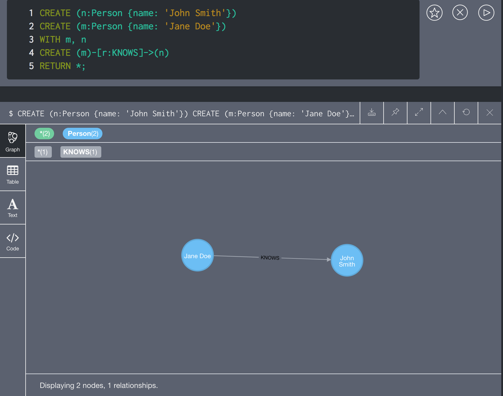
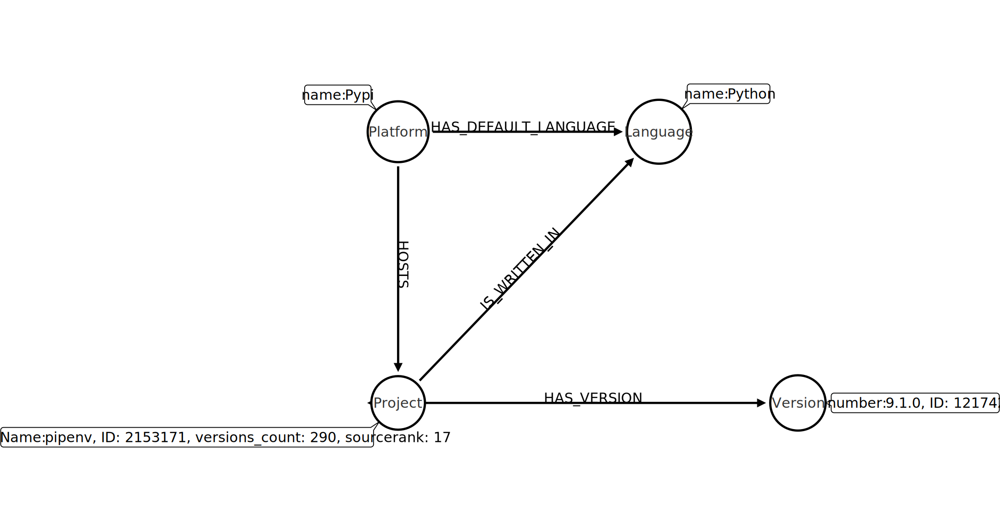

# Finding the Most Influential PyPi Contributor using Neo4j and Libraries.io Open Data
Upon coming across the excellent [`pipenv`](https://pipenv.readthedocs.io/en/latest/) 
package, written by Kenneth Reitz (he of [`requests`](https://requests.readthedocs.io/en/latest/)
fame), I wondered whether the adoption of this package by the Python Packaging 
Authority as the go-to 
[dependency manager for Python](https://packaging.python.org/guides/tool-recommendations/#application-dependency-management)
makes Kenneth Reitz the most influential Python contributor on PyPi. After all, 
his mantra when developing a package is "<_Insert programming activity here_> for __humans__".
## Summary of Results

For how we arrived at this, read on.
## The Approach
### Libraries.io Open Data
[PyPi](https://pypi.org/) is the repository for Python packages that developers
know and love. Analogously to PyPi, other programming languages have their respective package
managers, such as CRAN for `R`. As a natural exercise in abstraction, 
[Libraries.io](https://libraries.io) is a meta-repository for 
package managers. From [their website](https://libraries.io/data):

> Libraries.io gathers data from **36** package managers and **3** source code repositories. 
We track over **2.7m** unique open source packages, **33m** repositories and **235m**
interdependencies between [sic] them. This gives Libraries.io a unique understanding of 
open source software. An understanding that we want to share with **you**.

#### Using Open Data Snapshot to Save API Calls
Libraries.io has an easy-to-use [API](https://libraries.io/api), but
given that PyPi is the fourth-most-represented package manager in the Open Data
with 200,000+ packages, the number of API calls to various endpoints to collate 
the necessary data is not appealing (also, Libraries.io rate limits to 60 requests
per minute). Fortunately, [Jeremy Katz on Zenodo](https://zenodo.org/record/2536573)
maintains snapshots of the Libraries.io Open Data source. The most recent
version is a snapshot from 22 December 2018, and contains the following CSV files:
  1. Projects (3 333 927 rows)
  2. Versions (16 147 579 rows)
  3. Tags (52 506 651 rows)
  4. Dependencies (105 811 885 rows)
  5. Repositories (34 061 561 rows)
  6. Repository dependencies (279 861 607 rows)
  7. Projects with Related Repository Fields (3 343 749 rows)

More information about these CSVs is in the `README` file included in the Open
Data tar.gz, copied [here](https://github.com/ebb-earl-co/libraries_io/blob/master/data/README).
There is a substantial reduction in the data when subsetting these CSVs just
to the data pertaining to Pypi; find the code used to subset them and the
size comparisons [here](https://github.com/ebb-earl-co/libraries_io/blob/master/data/pypi_subsetting.md).

**WARNING**: The tar.gz file that contains these data is 12 GB itself, and
once downloaded takes quite a while to un`tar`; once expanded, the data
take up 64 GB on disk!

### Graph Databases, Starring Neo4j
Because of the interconnected nature of software packages (dependencies,
versions, maintainers, etc.), finding the most influential "item" in that web 
of data make [graph databases](https://db-engines.com/en/ranking/graph+dbms) and 
[graph theory](https://medium.freecodecamp.org/i-dont-understand-graph-theory-1c96572a1401)
the ideal tools for this type of analysis. [Neo4j](https://neo4j.com/product/)
is the most popular graph database according to [DB engines](https://neo4j.com/product/),
and is the one that we will use for the analysis.
Part of the reason for its popularity is that its query language,
[Cypher](https://neo4j.com/developer/cypher-query-language/), is expressive and simple:



Terminology that will be useful going forward:
  - `Jane Doe` and `John Smith` are __nodes__ (equivalently: __vertexes__)
  - The above two nodes have __label__ `Person`, with __property__ `name`
  - The line that connects the nodes is an __relationship__ (equivalently: __edge__)
  - The above relationship is of __type__ `KNOWS`
  - `KNOWS`, and all Neo4j relationships, are __directed__; i.e. `Jane Doe`
  knows `John Smith`, but not the converse

On MacOS, the easiest way to use Neo4j is via the Neo4j Desktop app, available 
as the [`neo4j` cask on Homebrew](https://github.com/Homebrew/homebrew-cask/blob/master/Casks/neo4j.rb).
Neo4j Desktop is a great IDE for Neo4j, allowing simple installation of different
versions of Neo4j as well as plugins that are optional 
(e.g. [`APOC`](https://neo4j.com/docs/labs/apoc/current/)) but
are really the best way to interact with the graph database. Moreover, the
screenshot above is taken from the Neo4j Browser, a really nice interactive
query interface as well as visual query result.
### Making a Graph of CSV Data
[Importing from CSV](https://neo4j.com/docs/cypher-manual/3.5/clauses/load-csv/)
is the most common way to populate a Neo4j graph, and is how we will
proceed given that the Open Data snapshot un`tar`s into CSV files. However,
first a data model is necessary— what the entities that will be
represented as labelled nodes with properties and the relationships 
among them are going to be. Moreover, some settings of Neo4j
will have to be customized for proper and timely import from CSV.
#### Data Model
Basically, when translating a data paradigm into graph data form, the nouns
become nodes and how the nouns interact (the verbs) become the relationships.
In the case of the Libraries.io data, the following is the data model
(produced with the [Arrow Tool](https://www.apcjones.com/arrow)):



#### Database Constraints
Analogously to primary key, foreign key, uniquness, and other constraints
in a relational database, Neo4j has 
[uniqueness constraint](https://neo4j.com/docs/cypher-manual/3.5/schema/constraints/#query-constraint-unique-nodes)
which is very useful in constraining the number of nodes created. Basically,
it isn't useful or performant to have two different nodes representing the
platform Pypi because it is a unique entity. Moreover, uniqueness constraints
enable 
[more performant queries](https://neo4j.com/docs/cypher-manual/3.5/clauses/merge/#query-merge-using-unique-constraints).
The following
[Cypher commands](https://github.com/ebb-earl-co/libraries_io/blob/master/cypher/schema.cypher)
add uniquness constraints on the properties of the nodes that should be unique
in this data paradigm:
```cypher
CREATE CONSTRAINT on (platform:Platform) ASSERT platform.name IS UNIQUE;
CREATE CONSTRAINT ON (project:Project) ASSERT project.name IS UNIQUE;
CREATE CONSTRAINT ON (project:Project) ASSERT project.ID IS UNIQUE;
CREATE CONSTRAINT ON (version:Version) ASSERT version.ID IS UNIQUE;
CREATE CONSTRAINT ON (language:Language) ASSERT language.name IS UNIQUE;
```
All of the `ID` properties come from the first column of the CSVs and are 
ostensibly primary key values. The `name` property of `Project` nodes is
also constrained to be unique so that queries seeking to match nodes on
the property name— the way that we think of them— are performant as well.
